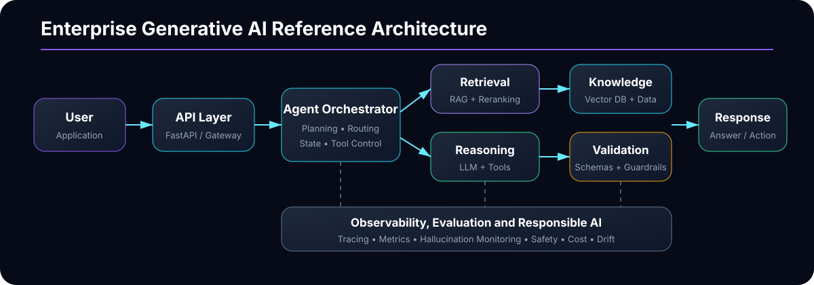
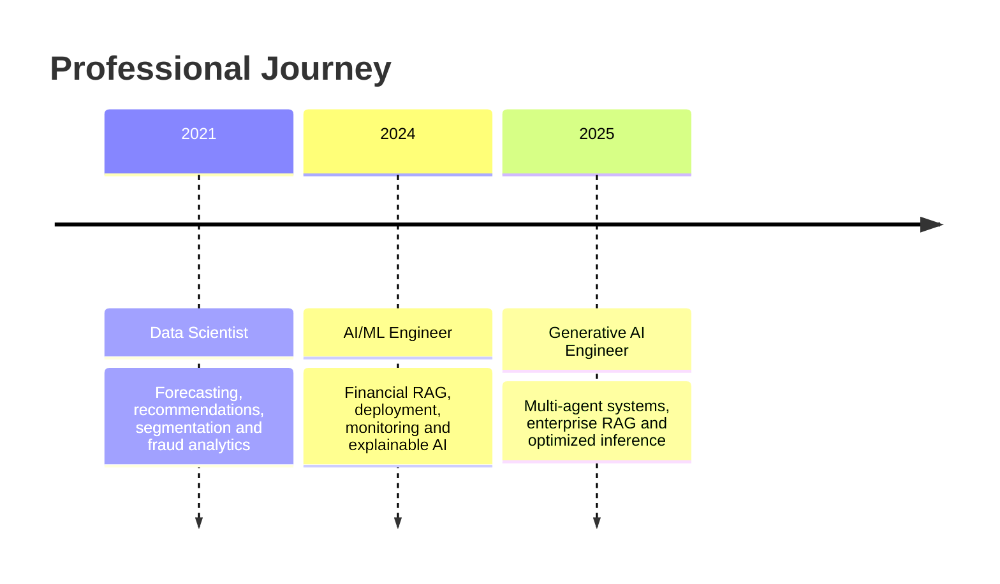

<div align="center">


<br/>

[](https://git.io/typing-svg)

[](https://linkedin.com/in/akarshana)
[](mailto:Akarshanamachanpally@gmail.com)
[](https://github.com/Akarshanagoud?tab=repositories)
[](https://github.com/Akarshanagoud)

</div>

---

## Navigation

<p align="center">
  <a href="#about-me">About</a> •
  <a href="#what-i-build">What I Build</a> •
  <a href="#featured-projects">Projects</a> •
  <a href="#technology-stack">Tech Stack</a> •
  <a href="#professional-experience">Experience</a> •
  <a href="#github-analytics">Analytics</a> •
  <a href="#education-and-certifications">Education</a> •
  <a href="#connect-with-me">Connect</a>
</p>

---

## About Me

I am a **Generative AI Engineer with 4+ years of experience** building production-ready AI and machine-learning systems across **healthcare, financial services, and retail**.

My work sits at the intersection of:

- Large Language Models
- Retrieval-Augmented Generation
- Multi-agent AI systems
- Cloud-native AI infrastructure
- Machine learning and data engineering
- Responsible AI and model observability

I enjoy turning ambiguous business requirements into secure, measurable, scalable systems that can move from prototype to production.

```python
class Akarshana:
    role = "Generative AI Engineer"
    focus = [
        "Multi-Agent Systems",
        "Enterprise RAG",
        "LLM Fine-Tuning",
        "LLMOps",
        "Responsible AI",
        "Cloud AI Infrastructure",
    ]

    def engineering_principle(self):
        return "Build AI that is useful, grounded, observable, secure, and production-ready."
```

---

## What I Build

<table>
<tr>
<td width="50%" valign="top">

### Multi-Agent AI

I design orchestrated AI systems in which specialized agents handle planning, retrieval, validation, reasoning, and approved tool execution.

**Typical capabilities**

- Supervisor and worker agents
- Tool-calling workflows
- Human approval checkpoints
- Structured outputs
- Retry and fallback logic
- Prompt and trace observability

</td>
<td width="50%" valign="top">

### Enterprise RAG

I build retrieval systems that connect LLMs to trusted enterprise data while improving relevance, attribution, and answer faithfulness.

**Typical capabilities**

- Document ingestion
- Semantic chunking
- Embeddings and vector search
- Hybrid retrieval
- Reranking
- Grounded answer generation

</td>
</tr>
<tr>
<td width="50%" valign="top">

### LLM Fine-Tuning and Inference

I adapt language models for domain-specific workloads and deploy them through scalable, low-latency inference systems.

**Typical capabilities**

- LoRA and QLoRA
- PEFT
- Instruction tuning
- Quantized inference
- Continuous batching
- GPU-aware serving

</td>
<td width="50%" valign="top">

### Responsible and Observable AI

I treat safety, reliability, and monitoring as core product features rather than post-deployment additions.

**Typical capabilities**

- Prompt validation
- Hallucination monitoring
- Output filtering
- Bias mitigation
- Model drift detection
- Trace-level debugging

</td>
</tr>
</table>

---

## System Architecture




---

# Featured Projects

> Selected AI and machine-learning projects demonstrating agentic AI, RAG, LLMOps, forecasting, recommendation systems, and production engineering.

<details open>
<summary><b>01 — Enterprise Multi-Agent Healthcare Automation Platform</b></summary>

### Overview

A production-oriented multi-agent AI platform designed to automate complex healthcare workflows while maintaining traceability, structured execution, and responsible AI controls.

### Problem

Healthcare workflows often require multiple reasoning steps, policy checks, document retrieval, and integration with enterprise systems. A single chatbot is not sufficient for dependable execution.

### Architecture

- **Supervisor agent** routes work and manages state.
- **Planner agent** converts goals into executable steps.
- **Retrieval agent** searches approved enterprise knowledge.
- **Reasoning agent** interprets domain context.
- **Validation agent** checks structure, policy compliance, and completeness.
- **Action agent** invokes approved APIs.
- **Observability layer** captures prompts, tool calls, latency, and failures.

### Technologies

`Python` `LangChain` `AutoGen` `Agent K` `AWS Bedrock` `FastAPI` `Pydantic` `Docker` `Kubernetes`

### Key Engineering Decisions

- Bounded agent responsibilities to reduce unpredictable behavior.
- Pydantic schemas for reliable downstream integration.
- Human-in-the-loop approval for high-impact actions.
- Retry and fallback behavior for failed tools.
- Prompt and output guardrails for safer execution.
- Centralized tracing for debugging agent workflows.

### Value

The platform improves operational consistency, accelerates access to enterprise knowledge, and supports safer adoption of agentic AI in healthcare environments.

</details>

<details>
<summary><b>02 — Clinical Document Intelligence and Enterprise RAG</b></summary>

### Overview

A Retrieval-Augmented Generation system that converts large clinical and enterprise document collections into searchable, context-aware knowledge.

### End-to-End Pipeline

1. Ingest documents from approved storage.
2. Extract and normalize text.
3. Enrich content with metadata.
4. Split documents into semantically meaningful chunks.
5. Generate vector embeddings.
6. Store vectors in a searchable index.
7. Retrieve and rerank relevant passages.
8. Generate a grounded response.
9. Evaluate relevance, faithfulness, and safety.
10. Log sources, latency, and model behavior.

### Technologies

`LlamaIndex` `LangChain` `Hugging Face Transformers` `Pinecone` `FAISS` `Chroma` `AWS` `Python`

### Features

- Metadata-aware retrieval
- Semantic and hybrid search
- Context compression
- Passage reranking
- Source-grounded responses
- Structured information extraction
- Hallucination monitoring
- Access-aware retrieval

### Engineering Tradeoffs

The system balances recall, precision, chunk size, latency, context-window limits, data freshness, security, and infrastructure cost.

</details>

<details>
<summary><b>03 — High-Performance LLM Fine-Tuning and Inference Platform</b></summary>

### Overview

A scalable platform for adapting open-source language models to domain data and serving them through optimized inference endpoints.

### Fine-Tuning Workflow

- Curate and validate instruction data.
- Analyze token distributions and sequence lengths.
- Apply LoRA, QLoRA, and PEFT.
- Track hyperparameters and checkpoints.
- Run offline quality and safety evaluations.
- Promote validated models to controlled serving environments.

### Inference Stack

- **vLLM** for continuous batching and throughput.
- **TensorRT-LLM** for GPU-optimized execution.
- **Triton Inference Server** for production serving.
- **AWS SageMaker** and **Azure ML** for managed deployment.
- Docker and Kubernetes for portability and autoscaling.

### Metrics

- Time to first token
- Tokens generated per second
- P50 and P95 latency
- GPU memory utilization
- Request failure rate
- Output quality after quantization
- Cost per request

</details>

<details>
<summary><b>04 — Financial RAG and Risk Intelligence Platform</b></summary>

### Overview

An enterprise AI solution for contextual financial question answering, explainable risk intelligence, and secure integration with existing applications.

### Capabilities

- Retrieval over financial knowledge sources
- Structured response generation
- Financial risk insight extraction
- Explainability support
- LLM trace analysis
- Model drift monitoring
- Secure API integration
- Containerized cloud deployment

### Technologies

`Python` `LangChain` `AWS Lambda` `Azure ML` `Spark` `Pydantic` `Docker` `Kubernetes`

### Reliability Controls

- Prompt and retrieval logging
- Schema validation
- Failure and retry handling
- Explainability metadata
- Drift monitoring
- Versioned deployments
- Controlled model promotion

</details>

<details>
<summary><b>05 — Retail Demand Forecasting and Inventory Optimization</b></summary>

### Overview

A large-scale forecasting system for predicting demand across hundreds of SKUs and supporting replenishment, inventory, and promotional decisions.

### Workflow

- Processed retail datasets using PySpark.
- Built lag, rolling-window, seasonality, pricing, and promotion features.
- Evaluated forecasting models across product segments.
- Automated retraining with Airflow and MLflow.
- Deployed models through REST APIs on AWS.

### Impact

- Reduced stockout incidents by **22%**.
- Improved inventory turnover.
- Reduced feature-extraction runtime by **40%** using Spark optimization.
- Sustained accuracy through seasonal and promotional changes.

### Technologies

`Python` `PySpark` `Apache Spark` `Airflow` `MLflow` `AWS SageMaker` `ECS`

</details>

<details>
<summary><b>06 — Personalized Recommendation Engine</b></summary>

### Overview

A recommendation system that learns from user behavior, purchase history, and product interactions to improve relevance and product discovery.

### Methods

- Collaborative filtering
- Matrix factorization
- User and product embeddings
- Candidate generation
- Ranking
- Offline evaluation
- A/B experimentation
- Real-time API serving

### Business Value

The system supports more relevant product discovery and increased average order value.

</details>

<details>
<summary><b>07 — Product Return Fraud and Anomaly Detection</b></summary>

### Overview

An anomaly detection platform for identifying suspicious product-return behavior and strengthening retail supply-chain integrity.

### Models

- Isolation Forest
- Autoencoders
- Statistical anomaly detection
- Behavioral feature engineering
- Risk threshold calibration

### Engineering Challenges

- Severe class imbalance
- False-positive control
- Changing fraud behavior
- Investigator capacity
- Explainability
- High-volume scoring

</details>

<details>
<summary><b>08 — Customer Segmentation and Marketing Intelligence</b></summary>

### Overview

A data-science workflow that groups customers using behavioral and transactional attributes to support personalization and campaign targeting.

### Techniques

- K-Means
- DBSCAN
- Feature normalization
- Cluster quality evaluation
- Segment profiling
- Campaign lift measurement

### Value

The resulting segments supported more targeted customer engagement and improved campaign conversion.

</details>

---

# Repository Showcase

Explore selected repositories and their engineering focus.

<table>
<tr>
<td width="50%" valign="top">

### Enterprise RAG Platform

Production-style document intelligence system with ingestion, embeddings, retrieval, reranking, grounded generation, and evaluation.

**Stack:** Python, LangChain, LlamaIndex, FAISS, FastAPI, Docker

[Open repository](https://github.com/Akarshanagoud/rag-knowledge-assistant)

</td>
<td width="50%" valign="top">

### Multi-Agent AI Platform

Agent orchestration system with planning, retrieval, validation, tool usage, guardrails, and structured outputs.

**Stack:** Python, AutoGen, CrewAI, LangChain, Pydantic

[Open repository](https://github.com/Akarshanagoud/multi-agent-healthcare-workflows)

</td>
</tr>
<tr>
<td width="50%" valign="top">

### LLM Inference Monitoring

LLMOps reference platform for inference monitoring, prompt tracing, latency analysis, response validation, and deployment readiness.

**Stack:** Python, LLMOps, observability, Docker, monitoring

[Open repository](https://github.com/Akarshanagoud/llm-inference-monitoring)

</td>
<td width="50%" valign="top">

### ML Forecasting Platform

Scalable forecasting and feature engineering pipeline for retail inventory and demand prediction.

**Stack:** Python, PySpark, Airflow, MLflow, AWS

[Open repository](https://github.com/Akarshanagoud/retail-forecasting-recommender)

</td>
</tr>
</table>

---

# Technology Stack

<details open>
<summary><b>Generative AI and Agentic Systems</b></summary>
<br/>


</details>

<details>
<summary><b>Fine-Tuning, Machine Learning and Inference</b></summary>
<br/>


</details>

<details>
<summary><b>Cloud, Data and MLOps</b></summary>
<br/>


</details>

<details>
<summary><b>Programming, APIs and Databases</b></summary>
<br/>


</details>

---

# Professional Experience



### Generative AI Engineer — Elevance Health
**March 2025 – Present**

- Designed multi-agent AI systems for enterprise healthcare automation.
- Built contextual RAG pipelines using LlamaIndex and vector databases.
- Engineered scalable inference with SageMaker, Triton, vLLM, and TensorRT-LLM.
- Fine-tuned language models using LoRA, QLoRA, and PEFT.
- Improved multi-turn reasoning and function-calling accuracy.
- Implemented Responsible AI guardrails and hallucination monitoring.

### AI/ML Engineer — JPMorgan Chase
**February 2024 – February 2025**

- Developed financial RAG pipelines and contextual question-answering systems.
- Built multi-agent services using AWS Lambda and containerized components.
- Used Pydantic for structured output validation.
- Developed deployment, retraining, and monitoring pipelines.
- Added model explainability and drift detection.
- Integrated AI models with enterprise financial systems.

### Data Scientist — Walmart
**June 2021 – July 2023**

- Built retail demand forecasting models across hundreds of SKUs.
- Developed recommendation systems using collaborative filtering and matrix factorization.
- Built customer segmentation workflows using K-Means and DBSCAN.
- Created anomaly-detection models for product-return fraud.
- Optimized multi-terabyte Spark ETL pipelines.
- Deployed ML models as REST APIs on AWS.

---

# Skills Matrix

| Area | Focus |
|---|---|
| Multi-Agent AI | Orchestration, planning, tools, validation, human review |
| Enterprise RAG | Ingestion, chunking, embeddings, retrieval, reranking |
| LLM Fine-Tuning | LoRA, QLoRA, PEFT, instruction tuning |
| LLM Infrastructure | vLLM, TensorRT-LLM, Triton, SageMaker |
| Responsible AI | Guardrails, validation, hallucination monitoring |
| Machine Learning | Forecasting, recommendations, clustering, anomaly detection |
| Data Engineering | Spark, Airflow, Kafka, ETL, batch and streaming |
| Cloud | AWS, Azure, containerized deployment, monitoring |

---

# Currently Exploring

- Model Context Protocol
- Agent-to-Agent communication
- Graph RAG
- Reasoning-model evaluation
- LLM observability
- Model distillation
- Retrieval evaluation
- Secure AI agents
- Cost-efficient inference
- Open-source LLM deployment

---

# GitHub Analytics

<div align="center">


<br/>


<br/>


<br/>


</div>

---

# Contribution Snake

<div align="center">


</div>

> This animation appears after the included `snake.yml` workflow runs successfully and publishes the `output` branch.

---

# Education and Certifications

### Education

- **Master of Science — Network and Computer Security**  
  SUNY Polytechnic Institute

- **Bachelor of Science — Computer Science**  
  Methodist College of Engineering and Technology

### Certifications

- CompTIA Security+
- Cisco Certified DevNet Associate
- Google Cloud Certified
- NDG Linux Essentials
- Cisco Cybersecurity
- Cisco Networking Essentials

---

# Engineering Principles

```text
01. Ground LLM responses in trusted context.
02. Validate structured outputs before execution.
03. Give agents bounded responsibilities.
04. Treat observability as a product capability.
05. Evaluate quality, safety, latency, reliability and cost together.
06. Build systems that fail safely and recover predictably.
07. Prefer measurable engineering outcomes over impressive demos.
```

---

# Connect With Me

I am interested in opportunities and collaborations involving:

- Generative AI engineering
- Multi-agent systems
- Enterprise RAG
- LLM infrastructure
- Applied machine learning
- Responsible AI
- AI observability
- Cloud-native AI platforms

<div align="center">

[](https://linkedin.com/in/akarshana)
[](mailto:Akarshanamachanpally@gmail.com)
[](https://github.com/Akarshanagoud?tab=repositories)

<br/><br/>

### Build thoughtfully. Evaluate honestly. Deploy responsibly.

</div>
