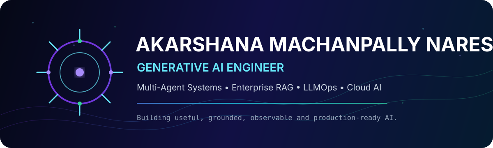

 

---

## About Me

I am a **Generative AI Engineer with 4+ years of experience** building production-grade AI systems across healthcare, financial services, and retail.

My work focuses on:

- Multi-agent LLM systems and agentic workflows
- Enterprise Retrieval-Augmented Generation
- LLM fine-tuning and optimized inference
- Responsible AI and observability
- AWS and Azure AI infrastructure
- Machine learning and large-scale data engineering

---

## Selected Impact

<table>
<tr>
<td align="center" width="33%">
<h3>36%</h3>

Improvement in multi-turn LLM response accuracy

</td>
<td align="center" width="33%">
<h3>22%</h3>

Reduction in retail stockout incidents

</td>
<td align="center" width="33%">
<h3>40%</h3>

Reduction in Spark feature-extraction time

</td>
</tr>
</table>

---

## Featured Projects

<table>
<tr>
<td width="50%" valign="top">

### Multi-Agent Healthcare Workflows

Healthcare-oriented agentic workflow for document routing, retrieval, structured extraction, validation, and responsible AI controls.

**Tech:** `Python` `LangChain` `AutoGen` `Agent K` `AWS Bedrock` `FastAPI`

[View repository →](https://github.com/Akarshanagoud/multi-agent-healthcare-workflows)

</td>
<td width="50%" valign="top">

### RAG Knowledge Assistant

Production-style document question-answering application with ingestion, chunking, embeddings, vector search, reranking, and grounded responses.

**Tech:** `Python` `LangChain` `LlamaIndex` `FAISS` `Pinecone` `Chroma`

[View repository →](https://github.com/Akarshanagoud/rag-knowledge-assistant)

</td>
</tr>

<tr>
<td width="50%" valign="top">

### LLM Inference Monitoring

LLMOps reference project for prompt tracing, response validation, latency monitoring, model-serving observability, and deployment reliability.

**Tech:** `Python` `vLLM` `Triton` `TensorRT-LLM` `Docker` `Kubernetes`

[View repository →](https://github.com/Akarshanagoud/llm-inference-monitoring)

</td>
<td width="50%" valign="top">

### Retail Forecasting and Recommender

Machine-learning portfolio project combining demand forecasting, recommendation systems, feature engineering, experimentation, and model monitoring.

**Tech:** `Python` `PySpark` `Scikit-learn` `Airflow` `MLflow` `AWS`

[View repository →](https://github.com/Akarshanagoud/retail-forecasting-recommender)

</td>
</tr>

<tr>
<td width="50%" valign="top">

### AI Repository Intelligence

AI-assisted codebase analysis for repository summarization, semantic source search, architecture discovery, and developer insights.

[View repository →](https://github.com/Akarshanagoud/ai-repository-intelligence)

</td>
<td width="50%" valign="top">

### PromptGuard

Prompt-security project for validating inputs, filtering outputs, and applying responsible AI controls to LLM applications.

[View repository →](https://github.com/Akarshanagoud/promptguard)

</td>
</tr>
</table>

---

## Repository Showcase

<table>
<tr>
<td width="50%" valign="top">

### 🤖 Multi-Agent Healthcare Workflows

Healthcare-focused agentic AI system for document routing, retrieval, validation, structured extraction, and responsible AI controls.

**Stack:** `Python` `LangChain` `AutoGen` `Agent K` `AWS Bedrock` `FastAPI`

</td>
<td width="50%" valign="top">

### 📚 RAG Knowledge Assistant

Production-style RAG application with ingestion, embeddings, vector retrieval, reranking, grounded responses, and source-aware question answering.

**Stack:** `Python` `LangChain` `LlamaIndex` `FAISS` `Pinecone` `Chroma`

</td>
</tr>

<tr>
<td width="50%" valign="top">

### ⚡ LLM Inference Monitoring

LLMOps project for tracing prompts, validating responses, monitoring latency, and improving model-serving reliability.

**Stack:** `Python` `vLLM` `Triton` `TensorRT-LLM` `Docker` `Kubernetes`

</td>
<td width="50%" valign="top">

### 📈 Retail Forecasting and Recommender

Machine-learning platform combining demand forecasting, recommendation systems, feature engineering, experimentation, and drift monitoring.

**Stack:** `Python` `PySpark` `Scikit-learn` `Airflow` `MLflow` `AWS`

</td>
</tr>

<tr>
<td width="50%" valign="top">

### 🧠 AI Repository Intelligence

AI-assisted codebase analysis for repository summarization, semantic source search, architecture discovery, and developer insights.

</td>
<td width="50%" valign="top">

### 🛡️ PromptGuard

Prompt-security project for validating inputs, filtering outputs, and applying responsible AI controls to LLM applications.

</td>
</tr>
</table>

---

## Technology Stack

### Generative AI

`LLMs` `RAG` `Prompt Engineering` `Vector Embeddings` `Semantic Search` `AI Agents` `Agentic Workflows` `Structured Output Extraction`

### Frameworks and Fine-Tuning

`LangChain` `LlamaIndex` `AutoGen` `CrewAI` `Agent K` `Hugging Face Transformers` `LoRA` `QLoRA` `PEFT`

### Machine Learning and Inference

`PyTorch` `TensorFlow` `Scikit-learn` `vLLM` `TensorRT-LLM` `Triton Inference Server`

### Cloud and Data

`AWS` `Azure` `SageMaker` `Bedrock` `Azure ML` `Spark` `Airflow` `Kafka` `Snowflake`

### Engineering

`Python` `SQL` `PySpark` `Scala` `Java` `FastAPI` `Docker` `Kubernetes` `GitHub Actions`

### Databases

`PostgreSQL` `SQL Server` `MySQL` `Oracle` `MongoDB` `Pinecone` `FAISS` `Chroma`

---

## Professional Experience

### Generative AI Engineer — Elevance Health
**March 2025 – Present**

- Designed multi-agent AI systems for healthcare enterprise automation.
- Built RAG pipelines using LlamaIndex, embeddings, and vector databases.
- Engineered scalable inference with SageMaker, vLLM, Triton, and TensorRT-LLM.
- Fine-tuned Hugging Face models using LoRA, QLoRA, and PEFT.
- Improved multi-turn response accuracy by **36%**.
- Implemented Responsible AI guardrails and hallucination monitoring.

### AI/ML Engineer — JPMorgan Chase
**February 2024 – February 2025**

- Developed financial RAG systems and contextual question-answering workflows.
- Built multi-agent services using AWS Lambda and containerized components.
- Implemented structured output validation using Pydantic.
- Developed model deployment, explainability, and drift-monitoring pipelines.
- Integrated AI models with enterprise financial systems through Python APIs.

### Data Scientist — Walmart
**June 2021 – July 2023**

- Built demand forecasting models across hundreds of SKUs.
- Developed collaborative-filtering and matrix-factorization recommenders.
- Built customer segmentation and product-return fraud detection workflows.
- Reduced retail stockout incidents by **22%**.
- Reduced Spark feature-extraction runtime by **40%**.
- Deployed machine-learning models as REST APIs on AWS.

---

## GitHub Analytics

 

 

---

## Education and Certifications

- **Master of Science in Network and Computer Security** — SUNY Polytechnic Institute
- **Bachelor of Science in Computer Science** — Methodist College of Engineering and Technology

**Certifications:** `CompTIA Security+` `Cisco Certified DevNet Associate` `Google Cloud Certified` `NDG Linux Essentials` `Cisco Cybersecurity` `Cisco Networking Essentials`

---

## Connect With Me

